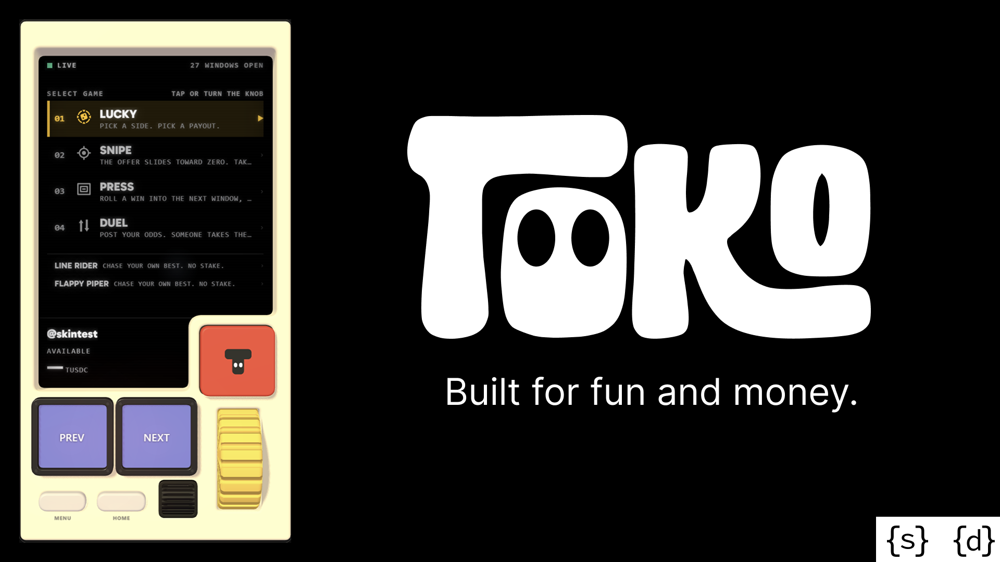

<div align="center">



# TOKO

**Trading apps make you read a book and place an order. Toko is a virtual game console which makes web3 trading and bets as a fun interactive game which you can play on your phone**

[](LICENSE)
[](https://docs.somnia.network)
[](https://nextjs.org)
[](https://threejs.org)

**[Play it → toko-pm.vercel.app](https://toko-pm.vercel.app)**
Somnia Shannon testnet · no wallet needed to try it

</div>

---

## The Background

Trading is stressful. Candles, order books, spreads, and a UI that assumes you
already know what all of it means. Attention spans are short and most people
want a bigger outcome from a smaller stake than an exchange is built to give
them. So the question this started from was: what if you just *played* it?

TOKO is that — a skeuomorphic 3D console you hold, with a knob, a thumbwheel and
three keys. But the thing it plays is not a game engine. You pick a side and a
price, the price *is* your multiple, and one live window is one round — entered,
settled by the oracle the moment it expires, and paid out at exactly 1 tUSDC per
winning contract.

**Nothing on screen is simulated.** Every price, book, countdown, fill,
settlement and payout comes from Shannon testnet. The single exception is **Demo
Mode**, which lets someone play before they have a wallet, is labelled
everywhere, and is described honestly below.

---

## What it does

Four trading games and two arcade ones, on one console. Every trading game puts
you on the same instrument — a binary window on a live order book — and changes
only what you are deciding.

### The games

All four trade live windows. None of them are reskins of a house model.

| Game | What it actually does |
|---|---|
| **Lucky** | The Round. One window is one round — the shortest live one; the knob is a limit price shown as its multiple, one ladder from `MKT` out to `100x` |
| **Snipe** | The wall is the underdog's real offer sliding toward zero. Wait too long and the maker pulls its quotes |
| **Press** | A roll ladder: a win's payout stakes the next window. Press or fold |
| **Duel** | **Co-op.** Your challenge is a resting order. Whoever takes it buys the opposite side and the pool **mints a pair** — two buyers, no seller, no market maker |

Plus two free minigames, which were always real; only their global leaderboard
was fake, and that is gone.

**The roster was eight, and four of them were the same game wearing a hat.**
Moonshot was Lucky's knob at the deep end, Rush was Lucky's live screen, Breakout
was Press with the side locked, and Pin was what Lucky already did when a limit
found nobody. Each mechanic was carried into the base game and verified working
*before* the page was deleted, so nothing a player could do became impossible:
Lucky's ladder now runs `MKT` to `100x` (Moonshot), its live screen shows what
the book will pay for the position right now (Rush), and an unfilled limit offers
to **rest** on the real book instead of dead-ending (Pin). Playing that rest *is*
providing liquidity, which is what this venue is short of.

**Range was retired** earlier, for a different reason: a band needs two strikes
at one expiry and this venue has one. Like the other four, it is not hidden
behind a flag — it is deleted.

### Demo Mode

The one place this app is allowed to be hypothetical, and it exists so someone
can hold the console before they have a wallet.

**Real:** the live order book at real depth, real windows and countdowns, the
real oracle feed, and **real settlement** — a paper position wins or loses on the
same oracle result as everyone else's.

**Hypothetical:** only your own fills, and they are priced by walking the
*actual* book level by level, exactly as an IOC would. They pay real depth's
prices, get worse as they eat through levels, partially fill when depth runs out,
and fail when nobody is there. A paper fill can never beat the book. A demo that
flatters you teaches expectations the real product then breaks.

**One `Executor`, swapped once.** Demo Mode is not a second implementation of
the games — it is one object substituted beneath them. The round, the ladder and
every screen above it are shared, which is why a paper fill walks the same real
book a live one does.


It is labelled on every screen, never claims anything happened on chain, and
ends the moment you fund a wallet. Anything that genuinely cannot be demoed —
Duel, and anything reading your own chain state — says so and offers setup
rather than faking it.

### Funding

- **Gas is sponsored.** There is no paymaster on Somnia and session transactions
  need a pre-funded account anyway, so the treasury tops up the embedded wallet
  directly. We know the address because we generated it.
- **500 tUSDC at signup, 100 a week after**, minted by the collateral contract's
  own faucet from your wallet. The cadence is a **schedule, not a lock** — that
  faucet will mint anyone any amount, so nothing here could enforce scarcity on
  a testnet. It shapes how starting out feels; it is not a security boundary.

---

## Install

```bash
cd web
npm install
npm run dev        # http://localhost:3000
```

With no configuration at all you can play **Demo Mode** immediately — live
markets, real settlement, hypothetical fills. Funding a real wallet needs one
secret; see below.

### Trying it in sixty seconds

1. Open `http://localhost:3000`.
2. **"Try it first"** — no wallet, no signup, no configuration. You are trading
   a live BTC window against the real book within seconds.
3. Play `/games/lucky`. Hold to expiry and the real oracle settles it.

**START** instead does the same thing for real: a wallet is generated in your
browser, gas is sponsored from the treasury, and **500 tUSDC** is minted to you.
That path needs `TREASURY_PRIVATE_KEY` set. Without it the app says so and points
at Somnia's public faucets rather than pretending to fund you.

### Configuration

Everything needed to *play* is already in the code — chain, contracts, indexer
and price feed all come from the SDK's deployment manifest. The only secret is
the gas sponsor.

Create `web/.env` (gitignored):

```bash
# Pays the gas for new players. Server-side only — never NEXT_PUBLIC_.
# A browser holding this key could be drained from devtools.
TREASURY_PRIVATE_KEY=0x...

# Only for the verification scripts below. The app never reads it.
PRIVATE_KEY=0x...
```

**Use two different accounts.** The treasury signs for strangers and the trading
key holds a position; one key doing both means a probe script and a public
endpoint share a balance, and either one draining takes the other down with it.

Fund the treasury with testnet STT from [the Somnia faucet
bot](https://t.me/somnia_helper_bot) (50 STT / 24h, no group join) or [Google
Cloud's](https://cloud.google.com/application/web3/faucet/somnia/shannon)
(1 STT / day). A transaction costs about **0.004 STT**, so 1 STT is roughly 250
trades.

**Node 22.** Next 16 wants 20.9+, and the verification scripts below need 22 for
native TypeScript stripping.

---

## Architecture

Three seams carry the whole build, and they are the things to understand before
editing anything.

**The screen is DOM under a transparent canvas.** A React subtree sits
*underneath* the canvas; each frame the canvas projects the screen cutout to
screen space and writes its rect onto the surface element. Missed taps are
forwarded down with `elementFromPoint`. Anything solid behind the shell would
show through the screen hole, which is why the back shell is hidden and the metal
side band is a frame rather than a plate.

**`ConsoleControls` is the contract.** Routes do not draw buttons; they call
`useProgramConsole({ main, action1, action2, knob, numberWheel, status,
lightShow })` and the 3D console reflects it. Handlers route through a ref so a
control can never fire a stale closure. MENU and HOME are hardware — they always
navigate, whatever the page asks.

```tsx
useProgramConsole({
  main: { label: "CASH OUT", pulse: true, onPress: round.sell },
  action1: { label: "LONG", onPress: () => round.buy("up", price, 1) },
  knob: { min: 0, max: 4, step: 1, value: i,
          format: (v) => `${(1 / PRICES[v]).toFixed(1)}x`, onChange: setI },
  status: { left: "LUCKY", right: `$${formatCollateral(balance)}` },
  lightShow: settled,
});
```


---

## User Flow

**One round.** Pick a side, pick a price, press. The order goes to the on-chain
book as an IOC; it either finds no counterparty and says so, or leaves you
holding contracts until the window closes and the oracle settles it. You can
cash out into the live bid at any point before the buzzer.


**The knob is a limit price.** Asking for a bigger multiple is asking to pay
less, which the book may or may not fill — the number you set is the odds you
are demanding, not a house setting.

### Duel — two players, no market maker

A challenge is not a database row. It is a real bid inside the spread, tagged on
chain in the order's `userData`, listed publicly at `/menu/duels` for anyone to
take. Mint-a-pair means the two of you trade with each other on a book nobody
else is standing in — verified on chain as `kind = MINT_A_PAIR`, two buyers,
0.500 each, one pair minted.


It also taught the sharpest lesson in the project: **a resting order cannot be
addressed.** The pool matches by price-time priority, so whoever accepts crosses
the *best* bid on that side, not the one your link names. A challenge is only a
duel if it is at the front of the book — which means posting one is posting the
best bid, and playing the game is providing liquidity, not merely adjacent to it.

---

## Deployed contracts (Somnia Shannon)

**No address is hardcoded in this repo.** The chain, the pool factory, the
collateral token, the indexer and the price feed all come from the markets SDK's
own deployment manifest (`SOMNIA_TESTNET_ADDRESSES`), so they move with the
release rather than with us. `web/lib/dreamdex/config.ts` is the only place that
reads it.

[DreamDEX Event Contracts](https://dreamdex.io): binary Up/Down markets on an
on-chain CLOB. A contract's price *is* its implied probability, so the payout is
exactly `1 / price`, and winners redeem 1 collateral unit. Zero fees.

That one fact is what lets the console survive intact: **the payout knob became a
limit price** and still reads as a multiple. 2x is 0.50, 3x is 0.33, 10x is 0.10.
`ConsoleControls` never changed.

Measured on Shannon rather than taken from the docs:

| | |
|---|---|
| Oracle resolve latency | **0 s** across 327 windows, **0 %** voided |
| Latest confirmed entry | **2.16 s** before expiry; the limit is liquidity, not the protocol |
| Order round trip | 2.5–3.0 s including the receipt |
| Redemption | exactly **1.000000 tUSDC** per winning contract |

**The venue's series are not fixed, and the console does not assume they are.**
Shannon ran 1-minute windows for months — the docs describe only 15m and 1h —
and then stopped rolling them; the 5-minute series stopped shortly after, while
new venues appeared running their own cadences (including 31s, 115s and 507s
one-offs). So every game asks for **the shortest live window with enough
runway** rather than naming a duration. A minute is the ideal and the round is
designed around it, but a game pinned to `60` simply stops finding a market the
day the venue moves on.

---

## Where it lives

The integration is one directory. Every capability maps to a file:

```
lib/dreamdex/             the integration
  config      chain, contracts, gas ceilings, grant sizes
  wallet      the Wallet seam + embedded browser key
  markets     live windows, on-chain status, rollover
  book        the four ladders, implied probability, multiples
  orders      buy / sell / rest / cancel, grid snapping, ns expiry
  positions portfolio redeem      ERC-6909 holdings, classification, claims
  coop        challenges: the public board, keep-alive, accepting
  execution   the Executor seam — the one object Demo Mode swaps
  stats achievements leaderboard activity
```

---

## Repository layout

Everything below is under `web/`.

```
app/
  page.tsx                attract mode
  games/                  4 trading games + 2 minigames
  menu/                   wallet, positions, markets, duels, history, …
  c/[code]/               taking a duel challenge
  api/topup/              gas sponsorship (server-side treasury key)
  api/activity/           explorer proxy for the transactions screen

lib/games/                useRound, useRollLadder
lib/demo.ts               the paper ledger
components/console/       the three.js device
```

---

## Continuing development

**The probe scripts that produced those numbers are not in this repo.** They were
run out of `web/scripts/` (`doctor`, `probe-settle`, `probe-first-trade`,
`probe-coop`) and were never committed, so the results stand on the write-up and
the on-chain transactions it cites, not on a script you can re-run here. Said
plainly rather than left as a path that 404s.

What you *can* run, from `web/`:

```bash
npm run build
npx tsc --noEmit                    # needs one build first, for .next/types
npx eslint .                        # `next build` does NOT run eslint
```

The live app is its own check: `/menu/markets` lists the venue's real windows,
and every trade screen links its transaction to the explorer.

### Further reading

**[HOW_TO_PLAY.md](HOW_TO_PLAY.md)** explains every game and its controls, for
players rather than developers.

**[SDK_FEEDBACK.md](SDK_FEEDBACK.md)** is our report back to Somnia — the SDK and
docs problems this build ran into, each with a reproduction, and the parts of the
protocol that turned out better than documented.

---

## License

[GNU General Public License v3.0](LICENSE). The console, the games and the
DreamDEX integration are all covered by it: if you ship something built on this,
ship its source too.
